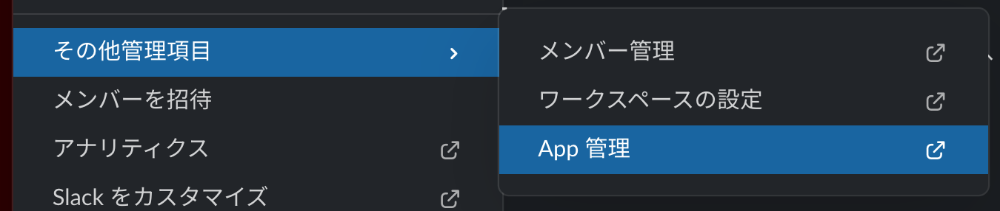
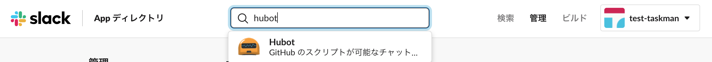
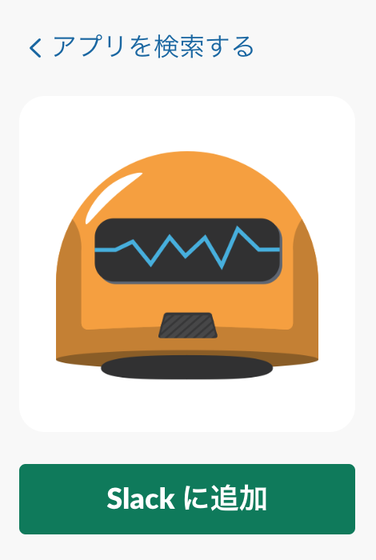
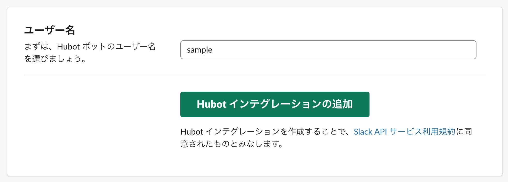
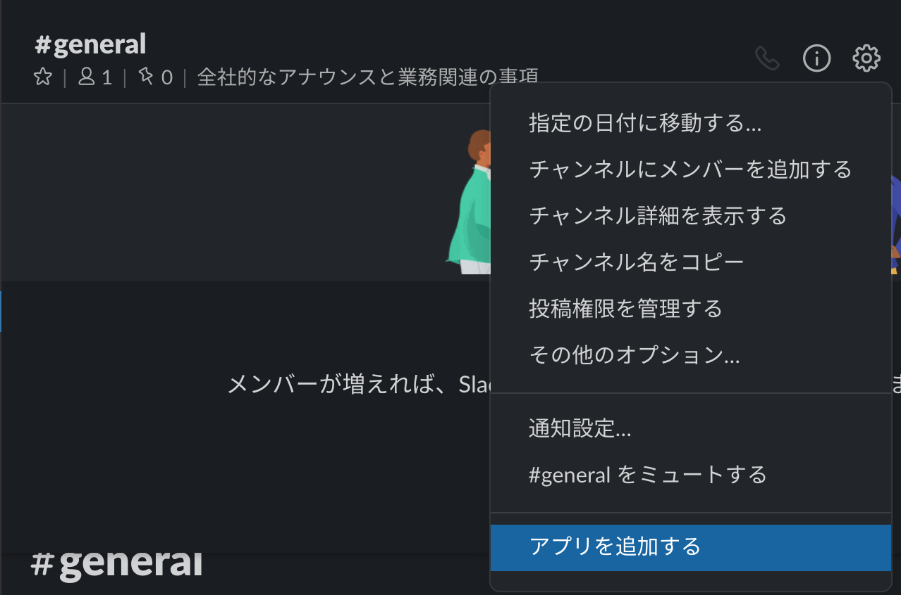
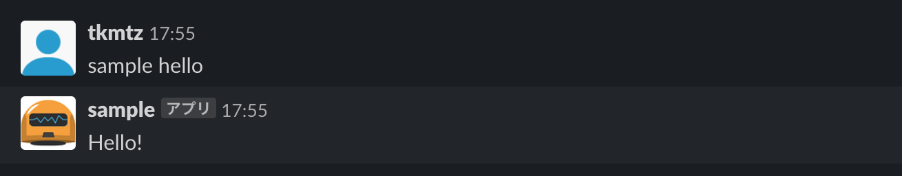

# Slack BOTを作ろう！ハンズオン

## 目次


## 1. Node.jsの導入

今回は、BOTを作成する上でのサーバーサイドのランタイムとして、Node.jsを使用します。

まずは、Node.jsが既にインストールされているかどうか確認してみましょう。

```shell
node -v
```

バージョン情報が出力されている場合は既に導入されています。

入っていない場合は、 https://nodejs.org/ja/ よりダウンロード・インストールして下さい。

## 2. Yeoman&hubotの導入

1項でNode.jsを導入したことで、npmが使用できるようになりました。

npmを用いて、必要なパッケージをインストールし、BOT開発の準備をしていきます。

以下のコマンドをコンソールに入力しましょう。

```sh
npm install -g yo generator-hubot
```

上のコマンドで、以下のパッケージがインストールされます。

1. Yeoman(webアプリの雛形作成ツール)
1. Yeomanのhubot用ジェネレーター

## 3. プロジェクト作成

実際に、プロジェクトを作成していきます。

まずは、プロジェクトディレクトリを作成しましょう。

```shell
mkdir ~/sampleApp
cd ~/sampleApp
```

続いて、Yeomanを用いてhubotプロジェクトの雛形を作成しましょう。

```shell
yo hubot
```

すると、謎のロボットが出てきます。

対話形式でプロジェクトを作成することになるので、それぞれの質問に答えていきましょう。

基本的には`()`内に表示されているデフォルトで大丈夫です。

Enter(return)キーを押下することでデフォルトを選択出来ます。

※ただし、Bot adapterの部分はデフォルトではなく、'slack'を入力して下さい。

```shell
                     _____________________________
                    /                             \
   //\              |      Extracting input for    |
  ////\    _____    |   self-replication process   |
 //////\  /_____\   \                             /
 ======= |[^_/\_]|   /----------------------------
  |   | _|___@@__|__
  +===+/  ///     \_\
   | |_\ /// HUBOT/\\
   |___/\//      /  \\
         \      /   +---+
          \____/    |   |
           | //|    +===+
            \//      |xx|

? Owner Mitsu <developer.mitsu@gmail.com>
? Bot name sampleapp
? Description A simple helpful robot for your Company
? Bot adapter slack
```

その後、もう一度ロボットが出てきます。

```shell
create bin/hubot
   create bin/hubot.cmd
   create Procfile
   create README.md
   create external-scripts.json
   create hubot-scripts.json
   create .gitignore
   create package.json
   create scripts/example.coffee
   create .editorconfig
                     _____________________________
 _____              /                             \
 \    \             |   Self-replication process   |
 |    |    _____    |          complete...         |
 |__\\|   /_____\   \     Good luck with that.    /
   |//+  |[^_/\_]|   /----------------------------
  |   | _|___@@__|__
  +===+/  ///     \_\
   | |_\ /// HUBOT/\\
   |___/\//      /  \\
         \      /   +---+
          \____/    |   |
           | //|    +===+
            \//      |xx|
```

この後、依存モジュールが読み込まれ、プロジェクトが作成されます。

実際に動作確認してみましょう。

ターミナル上で`./bin/hubot`を実行してみて下さい。その後Enter(return)キーを押下し、以下のように試してみましょう。

```shell
sampleapp> sampleapp ping
sampleapp> PONG
```

## 4. 実際に開発してみよう

hubotにおけるBOT開発は、scriptsディレクトリ内にファイルを作成して行います。

まずはscriptsディレクトリ内にscript.jsファイルを作成し、エディタで開きましょう。

```js
module.exports = (robot) => {
        robot.hear(/hello/i, (res) => {
                res.send('Hello!')
        })
}
```

上記を書き込み、BOTを起動(./bin/hubot)してみましょう。

```shell
sampleapp> Hello
sampleapp> Hello!
```

上記のように、BOTから応答が返ってくることを確認しましょう。

`/hello/i`の部分は正規表現です。

hearメソッドの他にも、様々なAPIがあります。

全体で多くは説明しませんので、実際にドキュメントを見ながら作ってみて下さい。

> 参考  
[公式ドキュメント](https://github.com/hubotio/hubot/blob/master/docs/scripting.md)  
[正規表現(MDN)](https://developer.mozilla.org/ja/docs/Web/JavaScript/Guide/Regular_Expressions)

## 5. Slackと連携してみよう

まずは、手順に従ってSlack側でhubotアプリを登録しましょう。

ワークスペースメニューからApp管理を選択します。


⇩  
hubotを検索し、

⇩  
slackに追加を押下しましょう  



⇩  
ユーザー名を入力し、インテグレーションを追加を押しましょう。



上記の手順を踏むと、`HUBOT_SLACK_TOKEN`が表示されるはずです。

後ほど使用するので、控えておきましょう。


続いて、実際にBOTを使用したいチャンネルにアプリを追加します。



⇩  
先程登録したsampleを追加しましょう。


全て完了したら、以下のコマンドをコンソールで実行してみましょう。

ただし、xxxの部分は先程表示されたHUBOT_SLACK_TOKENを入力して下さい。

`env HUBOT_SLACK_TOKEN=xxx bin/hubot --adapter slack`

実行後、slackで動作を確認してみましょう。



ここまでできれば、開発の準備は整いました。

実際に開発していきましょう！

